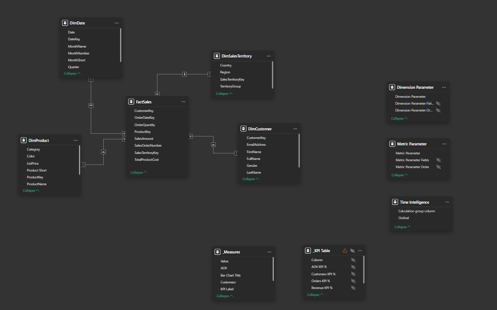

# Executive Sales Dashboard – AdventureWorks

Interactive Power BI executive dashboard built on the AdventureWorks Data Warehouse dataset.

---

## Project Overview

This project demonstrates an advanced Power BI analytics solution built using the AdventureWorks data warehouse. Data was extracted using SQL and modeled into an optimized star schema designed for analytical performance.

The dashboard focuses on executive-level monitoring of sales performance and provides both high-level KPIs and flexible analytical exploration.

---

## Dashboard Pages

### Executive Overview

The main dashboard provides a high-level overview of key sales metrics including revenue, orders, customers, and average order value. It also includes trend analysis and category-level insights to support executive decision-making.

---

### Ad-hoc Analysis Page

The ad-hoc analysis page enables flexible exploration of the dataset. Users can dynamically select metrics and dimensions using field parameters, allowing deeper investigation into sales performance.

---

## Data Model

The solution is built on an optimized **star schema data model**, designed to support analytical queries and efficient DAX calculations.

The semantic model includes:

- FactSales table for transactional data  
- Dimension tables for Date, Product, Customer, and Sales Territory  
- Parameter tables for dynamic analysis  
- Calculation Groups for reusable time intelligence logic  

---

## Key Features

• SQL-based data extraction from AdventureWorks DW  
• Optimized **star schema data model**  
• Advanced **DAX calculations** for business KPIs  
• **Calculation Groups** for scalable time intelligence (Current / PM / PY)  
• **Dynamic metric selection using field parameters**  
• **Advanced ad-hoc analysis page** allowing users to choose metrics and dimensions dynamically  
• Executive dashboard design for sales performance monitoring  

---

## Tools & Technologies

• **Power BI** – dashboard development and data visualization  
• **DAX** – advanced calculations and KPI logic  
• **Power Query (M)** – data transformation and preparation  
• **SQL** – data extraction from AdventureWorks Data Warehouse  
• **Tabular Editor** – calculation groups and semantic model enhancements  

---

## Repository Contents

- `Executive Dashboard.pbix` – Power BI report file  
- `Executive Dashboard.png` – Executive overview screenshot  
- `ad-hoc analysis page.png` – Ad-hoc analysis page screenshot  
- `image.png` – Data model diagram  
